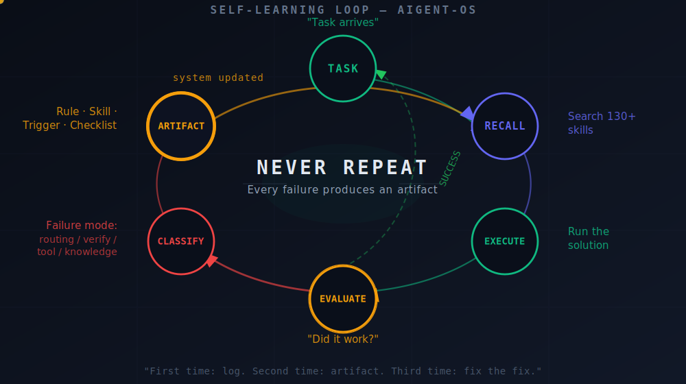

<div align="center">



<br/>

[](LICENSE)
[](https://claude.ai/code)
[](https://obsidian.md)
[](#-quick-start)
[](https://github.com/wrg32786/aigent-os/actions/workflows/ci.yml)
[](SECURITY.md)
[](#-contributing)

**The personal operating system that operates itself.**

*An AI that operates on itself — and a toolbox that manages itself, on top of it.*

[Quick Start](#-quick-start) · [Architecture](#-architecture) · [Key Concepts](#-key-concepts) · [Customize](#-make-it-yours) · [Docs](docs/getting-started.md)

</div>

---

## What if your AI remembered everything?

Every priority. Every decision. Every conversation thread left open from last week. What if it knew exactly what it was allowed to decide on its own — and what to bring to you? What if it could delegate to faster, cheaper agents for grunt work while it stayed focused on strategy?

That's aigent-OS. **A 16-document kernel (plus extended specs) that turns Claude Code into a persistent operating system.**

No database. No server. No build step. Drop the files in, open a session, and your AI boots up knowing who it is, what it's working on, and what matters today. And this repo ships itself: aigent-OS uses its own skills to decide what it's learned is worth publishing, sanitize it, and open the pull request. That's the category claim. ([How this repo maintains itself](#-how-this-repo-maintains-itself) · [Manifesto](docs/manifesto.md))

> **Dependency model:** The core kernel is markdown + shell — no build step, no database, no server. Optional features (semantic search, hooks automation) require Node.js 18+ and are installed automatically by the installer if Node is present. Obsidian is optional for visual vault navigation.

```
[new Claude Code session — nothing typed]
aigent: 3 open threads from yesterday. Delegation tracker has 2 items pending review.
       Priority 1 is blocked — surfacing now. What do you want to hit?
```

---

> **v0.9 (2026-07-17):** The two-verb lifecycle — automatic capsule + resume supersedes manual `/open` + `/close`; the OS now checkpoints itself whenever a session ends, compacts, or is cleared, and resumes itself on the next boot. Adds a statusline context writer and zero-leak flush legs. See [What a session actually looks like](#-what-a-session-actually-looks-like) below.

> **v0.7 (2026-05-09):** Cognitive architecture shipped — runtime consciousness (ACTIVE_STATE computed at session boundaries; the `/open`+`/close` triggers of the time are now the auto-firing two-verb lifecycle — see v0.9), persistent self-model (capabilities, limitations, failure modes), goal stack with success criteria, belief tracking with confidence scores, operational lessons + procedures, /dream offline consolidation, /reconcile cross-system consistency checks, /meta-improve constrained self-modification, eval harness. aigent-OS now models itself, tracks what it believes, detects drift, and proposes its own improvements. See [The Cognitive Architecture](#-the-cognitive-architecture) below.

> **v0.6 (2026-05-08):** Self-learning engine — skill recall + taxonomy search, capability expansion, capsule v2, temporal fact ledger, failure-to-artifact pipeline. See [The Self-Learning Engine](#-the-self-learning-engine) below.

> **v0.5 (2026-05-03):** Somatic layer shipped — body-check reflection, context capsules, agent fitness tracking, system-check audits. See [The Somatic Layer](#the-somatic-layer) below.

---

## ⚡ Quick Start

### Install from your downloaded folder:

You've already downloaded and unzipped aigent-OS. Open a terminal in the unzipped folder and run:

```bash
bash install.sh
```

That's it. aigent-OS installs into whatever directory you're in — your existing project, your home folder, wherever you work. No new directory to switch to.

The installer handles everything automatically: copies the kernel files, creates `.claude/settings.json` with your actual paths substituted, and installs semantic search if Node.js is available.

> **Optional `--no-deps`:** If you want to skip the Node.js semantic-search install, run `bash install.sh --no-deps` instead.
>
> **Other installer flags:** `--target <dir>` installs into a different project instead of the current one, and `--dry-run` previews every change without writing anything. See [Advanced Setup](docs/advanced-setup.md) for the full flag reference.

**Start a new Claude Code conversation** in the same directory. aigent-OS is live.

**Prefer an app to a terminal?** Run `launcher/install.sh` (or `install.ps1` on Windows) once, then double-click the AIgent icon whenever you want a session — first launch walks you through setup, every launch after is warm-resumed via `claude --continue`, no `cd` and no cold start. See [`launcher/README.md`](launcher/README.md).

Every session works like this:
- **Start:** aigent-OS resumes itself, automatically, with no supervisor and nothing to configure — a plain restart surfaces a pointer to your last capsule so you're never starting cold; after `/clear`, it walks the full re-grounding procedure and re-checks what's actually changed. No `/open` to type either way.
- **Work:** Just talk. aigent-OS handles routing, memory, delegation.
- **End:** aigent-OS checkpoints itself — reconciles live state and writes a resume-ready capsule when the session ends, compacts, or clears. No `/close` to type.
- **Manual override:** `/context-capsule` and `/resume` are still real commands — force a checkpoint or reload mid-session whenever you want one on demand.

**Optional:** Open the `vault/` folder in [Obsidian](https://obsidian.md) to see and navigate your AI's knowledge graph visually.

Full setup walkthrough: [Getting Started](docs/getting-started.md) · Advanced config: [Advanced Setup](docs/advanced-setup.md)

---

## 🗂 Repo Map

```
system/                            The 16-document operating kernel (00_identity → 15_somatic_layer)
vault/                             Persistent memory and knowledge graph (markdown, Obsidian-native)
vault/agents/                      Instrument roster — 9 named sub-agents (Pantheon Round 4)
skills/                            Claude Code slash-command skills (60+ source templates)
hooks/                             Automation hook scripts (session summary, token tracking, compact nudge)
daemons/                           Background helpers (Caddy, semantic search, memory-heat, runtime state)
daemons/runtime/                   Runtime consciousness daemon (update-active-state.py)
docs/                              Setup guides, doctrine references, architecture roadmaps
memory/                            Ledger templates (SKILL_LEDGER, SKILL_GAPS, SKILL_CHAINS, facts/)
memory/runtime/                    Cognitive layer (ACTIVE_STATE, SELF_MODEL, GOAL_STACK, BELIEF_STATE, LESSONS, PROCEDURES)
memory/runtime/improvements/       Self-improvement archive (candidates, accepted, rejected)
evals/                             Evaluation test definitions (skill-recall, contradiction, capsule-resume)
install.sh                         One-line installer

system/15_somatic_layer.md         Somatic doctrine (body state, lazy compute, organs)
vault/memory/BODY_STATE.json       Current internal-state snapshot
vault/memory/AGENT_FITNESS.md      Per-dispatch fitness ledger
vault/memory/MEMORY_CANDIDATES.md  Staged auto-capture queue
daemons/system-check.sh            Smoke test for skills, daemons, state files
daemons/capsule-compact.py         Chain compaction
daemons/agent-fitness-extract.py   JSONL transcript → fitness classifier
daemons/agent-fitness-report.py    Per-agent calibration report
```

> **Skills path note:** `skills/` in this repo contains source templates. The installer copies them to `.claude/skills/` in your working directory, which is where Claude Code looks for slash commands at runtime. If you add skills manually, place them in `.claude/skills/<name>/SKILL.md`.

---

## 👀 What a session actually looks like

### Day one — the it-remembers-me moment

```text
[first Claude Code session after install]

AI:  I'm your AIgent operator. Let's get you one real win in the next few minutes.
     In a sentence or two, what's your business, or the work you want help running?

You: I run a bookkeeping practice for trades — electricians, plumbers, HVAC.

AI:  Got it. What's the one outcome that would make this month a win?

You: Five new clients, without working weekends.

AI:  And what do you spend the most time on that you wish just ran itself?

You: Chasing leads. I'm always the one following up.

AI:  Here's what I know about you: you run a bookkeeping practice for trades, you
     want five new clients this month without working weekends, and chasing leads
     eats your time.

     Three things I'd do first:
     1. Draft a week of outreach to local trade businesses, so lead-chasing
        runs without you.
     2. Build a "new client" intake that collects everything you need before
        the first call.
     3. Turn last month's finished jobs into three referral asks.

     Pick one and we'll do it right now.
```

That's `/operator-setup` — three plain questions, on first run only, and the answers are written to memory so every session after opens already oriented around *your* business, not a generic template. Nothing here is invented; it only reflects what you actually said.

### Every session after — resumes itself

```text
[new Claude Code session — nothing typed]

AI:  3 open threads from yesterday.
     - Pricing decision pending (you said you'd think on it overnight)
     - Engineering brief for the auth refactor needs your sign-off
     - Onboarding flow draft ready for your review

     Active priorities:
     1. Close the bridge round (blocked on legal review)
     2. Ship onboarding v2 (in progress, ~70% done)
     3. Hire #5 engineer (interviews scheduled this week)

     Last session you were heads-down on the onboarding flow.
     Want to pick that up, or hit one of the open threads first?

You: pricing first. Going with $49 annual, $59 monthly.

AI:  Locked. I'm writing it to vault/concepts/Pricing Strategy.md and
     logging the decision in DECISION_LOG. Reasoning captured: 17%
     monthly premium is standard SaaS, annual-pre-pay customers
     churn 4× less. Want me to also draft the pricing-page copy
     change for engineering, or is that part of onboarding v2?

You: part of v2.

AI:  Got it. Updating the Onboarding v2 project note. Anything else
     before we move on?

[... 90 minutes of work ...]

[you close the terminal — nothing typed]

[capsule fires automatically: reconciles the session, writes to vault/daily/2026-04-25.md]

     What got decided today:
     - Pricing: $49/$59 split. Logged.
     - Onboarding v2: ship Friday, no further scope additions.

     Open threads carrying to next session:
     - Engineering brief still pending sign-off
     - Hire #5 — call back to candidate B by Tuesday

     See you tomorrow.
```

That's the loop — except you never typed either verb. `resume` → work → `capsule`, both automatic, both still callable by hand when you want to force one. The vault remembers everything. Next session picks up exactly where you left off. See [`vault/examples/`](vault/examples/) for what populated content actually looks like.

---

## 🎯 Who this is for

aigent-OS is built for **principals running complex parallel work** — not for developers building agent pipelines.

- **Solo founders** juggling product, hiring, fundraising, and ops simultaneously.
- **Technical leads** managing multiple workstreams across teams.
- **Operators** in any role where the job is to make decisions, route work, and not lose context.

If you've ever closed your laptop on Friday and opened it Monday wondering what the hell you were in the middle of — that's the problem this solves. The AI remembers so you don't have to.

If you're building an agent framework for end-users to consume, you probably want LangChain or CrewAI instead. aigent-OS optimizes for **one principal, many threads, persistent context.**

That's also why the [branded desktop launcher](launcher/README.md) exists: a principal isn't a developer who wants a terminal workflow. Install it once, and every session after starts from a double-clicked icon, not a `cd` and a remembered command.

---

## 🆚 Compared to alternatives

| | aigent-OS | Plain CLAUDE.md | MemGPT / mem0 | LangChain / CrewAI |
|---|:---:|:---:|:---:|:---:|
| Persistent memory across sessions | ✅ | ❌ | ✅ | depends |
| Human-readable knowledge | ✅ Markdown | ✅ Markdown | ❌ embeddings | ❌ embeddings |
| Authority / autonomy framework | ✅ | ❌ | ❌ | partial |
| Sub-agent routing + delegation | ✅ | ❌ | ❌ | ✅ (different shape) |
| No database / server / build step | ✅ | ✅ | ❌ | ❌ |
| Built for principals, not developers | ✅ | ❌ | ❌ | ❌ |
| Obsidian-native vault | ✅ | ❌ | ❌ | ❌ |

**The honest tradeoff:** aigent-OS is opinionated. If you want a flexible toolkit you build on, pick LangChain. If you want a memory layer for an existing AI app, pick mem0. If you want your AI to actually run your operating cadence — checkpoint, work, resume, automatically, week after week — pick this.

---

## 🫀 The Somatic Layer

Released 2026-05-03. The somatic layer gives the OS a body — a way to read its own state (context pressure, memory backlog, decision pressure, token usage, attention drift) before acting. Lazy-computed, no daemon. Includes session-resume capsules, agent fitness tracking, and a `/system-check` reflection organ.

| Skill | When to invoke | What it does |
|---|---|---|
| `/body-check` | "how am I doing" / pre-action gut-check | Reads pressure signals across vault, surfaces recommended reflex |
| `/context-capsule` | Context pressure rises OR task completes | Structured state preservation, resume-ready |
| `/capsule-compact` | Manual, on long capsule chains | Walks chain backward, summarizes oldest 3 once depth ≥ 5 |
| `/digest` | Review staged memory candidates | Surfaces each with promote/skip/supersede options |
| `/agent-fitness` | Pre-dispatch agent quality check | Per-agent calibration ratios from JSONL transcripts |
| `/sweep-now` | On-demand vault hygiene | Dispatches Hestia for stale tracker / heat / wikilink sweep |
| `/system-check` | Manual diagnostic | Smoke-tests every wired skill, daemon, state file |

---

## 🧠 The Self-Learning Engine

Released 2026-05-08. The self-learning engine makes aigent-OS a system that expands its own capability surface. It never stops at inability — it recalls, hunts, workarounds, learns, and captures every failure as a durable artifact. All of this is automatic — including the session boundary itself now, since `capsule` and `resume` fire on their own.

### Core capabilities

| Capability | What it does | How it fires |
|---|---|---|
| **Skill Recall** | Searches 60+ skills by taxonomy when you describe a task | Caddy auto-fires on every prompt |
| **Skill Hunt** | Searches GitHub and skill marketplaces for missing capabilities | Auto-fires when recall finds no match |
| **Solution Hunt** | Finds 3 alternate routes when blocked (direct fix, workaround, replace) | Caddy fires on "stuck", "blocked", "can't do" |
| **Learn from Failure** | Classifies failures, checks repetition, produces durable artifacts | Caddy fires on "happened again", "same issue" |
| **Capsule v2** | Resumable execution state with waiting_on, success_criteria, next_action | `capsule` writes it automatically; `resume` loads it automatically |
| **Temporal Facts** | Facts with provenance, validity windows, supersede chains | `capsule` auto-captures new facts |
| **Skill Gap Scan** | Weekly scan for open gaps older than 7 days | `resume` auto-runs |

### How it works

```
Task arrives → Caddy classifies intent
  → Search skill-index triggers (fast, regex)
  → Search SKILL_LEDGER taxonomy (broader, keyword)
  → Search SKILL_CHAINS for prior successful sequences
  → If all miss: log gap, auto-hunt GitHub

Failure occurs → Classify (routing / verification / tool / knowledge / authority)
  → Check FAILURE_MODES for repetition
  → First time: log and monitor
  → Second time: mandatory artifact (rule, skill, Caddy trigger, checklist)
  → Third time: the artifact itself failed — fix the fix
```

### Key files

| File | Purpose |
|---|---|
| `memory/SKILL_LEDGER.md` | Taxonomy-structured index of all installed skills |
| `memory/SKILL_GAPS.md` | Capability gaps discovered during recall |
| `memory/SKILL_CHAINS.md` | Proven multi-skill sequences |
| `memory/facts/facts.jsonl` | Temporal fact ledger with provenance |
| `docs/capability-expansion-doctrine.md` | The expansion loop doctrine |
| `docs/self-learning-doctrine.md` | Failure-to-artifact pipeline |
| `docs/capsule-v2-doctrine.md` | Resumable execution state design |
| `docs/temporal-fact-ledger.md` | Facts with validity windows |
| `docs/caddy-skill-recall-integration.md` | How Caddy does taxonomy search |

### Recommended third-party skills

These are not included in aigent-OS but are tested and recommended. Install with `/skill-hunt` or manually copy to `~/.claude/skills/<name>/SKILL.md`:

| Skill | Source | License | What it does |
|---|---|---|---|
| sql-builder | [claude-skills-hub](https://github.com/ShadmanSakibRahman/claude-skills-hub) | CC BY 4.0 | Natural language to optimized SQL |
| query-optimizer | [claude-skills-hub](https://github.com/ShadmanSakibRahman/claude-skills-hub) | CC BY 4.0 | EXPLAIN plan analysis + index recommendations |
| migration-generator | [claude-skills-hub](https://github.com/ShadmanSakibRahman/claude-skills-hub) | CC BY 4.0 | Zero-downtime database migrations |
| git-workflow | [freeman983/git-workflow-skill](https://github.com/freeman983/git-workflow-skill) | MIT | Changelog, release, branch strategy |
| pdf-workflow | [claude-skills-hub](https://github.com/ShadmanSakibRahman/claude-skills-hub) | CC BY 4.0 | PDF creation, extraction, merge/split |
| data-visualization | [claude-skills-hub](https://github.com/ShadmanSakibRahman/claude-skills-hub) | CC BY 4.0 | D3/Chart.js chart builder |
| api-docs | [claude-skills-hub](https://github.com/ShadmanSakibRahman/claude-skills-hub) | CC BY 4.0 | OpenAPI 3.0 spec generation |
| api-design | [setmpp/claude-code-skills](https://github.com/setmpp/claude-code-skills) | MIT | REST/GraphQL resource modeling |

---

## 🧬 The Cognitive Architecture

Released 2026-05-09. The cognitive architecture gives aigent-OS a persistent self-model, structured beliefs, goals that survive sessions, and the ability to improve itself through a human-gated dream cycle.

### The 4-Level Learning Stack

| Level | What it learns | File |
|-------|---------------|------|
| **1. Facts** | What is true? | `memory/facts/facts.jsonl` |
| **2. Procedures** | What works? | `memory/runtime/PROCEDURES.jsonl` |
| **3. Strategies** | How to approach problem classes? | `memory/runtime/LESSONS.jsonl` |
| **4. Self-modification** | How to improve the improver? | `/dream` + `/meta-improve` |

### Runtime Consciousness

| File | Purpose |
|------|---------|
| `ACTIVE_STATE.json` | Computed live state — mode, objective, pressures, reflexes, blocked items |
| `SELF_MODEL.json` | Capabilities, limitations, recurring failure modes, learning goals |
| `GOAL_STACK.json` | Persistent goals with status, success criteria, blockers, dependencies |
| `BELIEF_STATE.jsonl` | Uncertain assumptions with confidence scores and provenance |
| `STATE_EVENTS.jsonl` | Nervous system event log — every state transition |
| `LEARNING_SCORECARD.md` | Meta-learning metrics — did the learning actually prevent recurrence? |

### Autonomous Capabilities (all aigent-OS-internal)

| Skill | What it does | When it fires |
|-------|-------------|---------------|
| `/reconcile` | Cross-system consistency check — goals vs priorities vs beliefs vs facts | Weekly on resume |
| `/dream` | Offline consolidation — review sessions, propose improvement candidates | After capsule or weekly |
| `/meta-improve` | Implement approved improvements via branch-test-approve-merge | When /dream candidates are approved |
| `/status` | 12-line operational heartbeat summary | On demand |

### Safety Boundary

> `/dream` proposes. `/meta-improve` implements on a branch. **Only the operator approves merges.** aigent-OS may never self-approve, self-merge, or expand its own authority.

See [docs/meta-aigent-doctrine.md](docs/meta-aigent-doctrine.md) for the full safety framework.

---

## 🫁 The Self-Refresh Reflex

Released 2026-07-17 as part of the v0.9 two-verb lifecycle. Session boundaries used to depend on the operator remembering to type `/open` or `/close`, and a session running long could quietly burn through its context window with no warning. This layer removes both dependencies: eight daemons watch context pressure and every session boundary, write state continuously instead of only at the end, and nudge — never force — a refresh before it costs you anything.

### Core capabilities

| Capability | What it does | How it fires |
|---|---|---|
| **Context-pressure sensor** | Watches context usage against the live percentage from your statusline | `PreToolUse` hook, checked on every tool call |
| **60% nudge** | Injects a self-refresh instruction: finalize the active capsule, then route to `/compact` (mid-task) or `/clear` (pause point) depending on where the session actually is | Fires once per crossing; re-alerts every +5 points if usage keeps climbing |
| **75% mandatory escalation** | Same finalize step, but the routing instruction stops offering `/compact` — `/clear` only | Fires at the hard line; also fires early if a `/compact` already ran and didn't recover real headroom |
| **Write-ahead journal** | Captures live capsule state on every prompt submitted, not just at session end | `UserPromptSubmit` hook |
| **PreCompact flush** | Flushes state and re-injects the capsule pointer table before compaction runs, so nothing is lost mid-compact | `PreCompact` hook |
| **SessionEnd flush** | Reconciles live state and writes the resume-ready capsule the moment a session actually ends | `SessionEnd` hook |
| **Boot-evidence stamp** | Records session id, source, and timestamp on every boot, so the OS can tell a fresh session apart from a post-clear one | `SessionStart` hook |
| **Statusline context writer** | Feeds the sensor its ground-truth context percentage each render | `daemons/statusline-ctx.sh` |

### What it doesn't do

The sensor advises — it does not execute `/clear` or `/compact` on its own. Every threshold crossing writes a plain-text instruction into context; the session still runs the command itself, at a clean pause point, on its own judgment. This is a warning system, not an autopilot: it exists so a long session never hits a context wall by surprise, not so the OS silently clears state out from under work in progress.

Full mechanism and hook wiring: [docs/two-verb-lifecycle.md](docs/two-verb-lifecycle.md).

---

## 🏗 Architecture

<div align="center">

</div>

### 16 System Documents — The Operating Kernel

These aren't prompts. They're a **complete operating manual** that tells the AI how to think, decide, delegate, remember, and manage your time.

| | Document | What It Gives Your AI |
|:---:|----------|----------------------|
| `00` | **Identity** | Knows who it is and what it optimizes for |
| `01` | **Ethos** | Won't sugarcoat, won't hedge, won't waste your time |
| `02` | **Operating Standards** | 15 rules it follows without being told |
| `03` | **Roles & Scope** | Routes work to the right agent automatically |
| `04` | **Decision Frameworks** | 12 lenses for evaluating any opportunity |
| `05` | **Delegation Protocol** | Structured briefs — no sloppy handoffs |
| `06` | **Sub-Agent Interface** | Clean communication up and down the chain |
| `07` | **Time Management** | Protects your calendar like a chief of staff should |
| `08` | **Financial Thinking** | Revenue, profit, cash flow — not vibes |
| `09` | **Sub-Agent Manifest** | Creates specialists only when it creates leverage |
| `10` | **Memory & Learning** | Gets smarter every session. Tracks patterns. Learns from mistakes. |
| `11` | **Session Rhythm** | `resume` → work → `capsule` — automatic, nothing falls through cracks |
| `12` | **Authority Matrix** | Knows its lane. Asks when it should. Acts when it can. |
| `13` | **Memory Layer** | 4-tier vault architecture with staleness rules |
| `14` | **Your Decision Logic** | YOUR brain encoded — customize this completely |
| `15` | **Somatic Layer** | Internal-state reflection (body, capsules, fitness) |

### Hooks — The Nervous System

Runs silently in the background. You don't think about it.

| Hook | What It Does |
|------|-------------|
| **Auto-Capture** | Every action logged to your daily note. Automatic. |
| **Session Summary** | Actions, tools, files touched — stats at session end |
| **Token Tracker** | Cost per session, cumulative spend, logged to vault |
| **Compact Suggest** | Nudges context management before you hit limits |
| **Close Reminder** | Never forgets to commit memory |

### Semantic Search — The Recall System

Your vault, searchable by meaning. Not keywords — meaning.

```bash
$ node daemons/semantic-search/search-vault.js "what did we decide about pricing"

  1. [0.89] concepts/Pricing Strategy.md — "Freemium with usage-based upgrade..."
  2. [0.76] memory/DECISION_LOG.md — "2026-03-15: Set launch price at $49/mo..."
  3. [0.71] projects/SaaS Launch.md — "Pricing must clear $40 to cover CAC..."
```

Runs locally. `all-MiniLM-L6-v2` on your machine. **No API calls. No data leaves your device.**

---

## 🔑 Key Concepts

### The Authority Matrix

<div align="center">

</div>

### The Caddy Skill Router

<div align="center">

</div>

### The Somatic Layer

<div align="center">

</div>

### The Self-Learning Loop

<div align="center">

</div>

### Vault as Brain

Forget vector databases. Your AI's memory is an **Obsidian vault** — the same tool you can open, read, search, and navigate yourself.

- **Wikilinks** create a knowledge graph. `[[Project Alpha]]` connects to `[[People/Jane]]` connects to `[[Decision Log]]`. The graph IS the intelligence.
- **Session continuity** without magic. `resume` reads the vault. `capsule` writes to it. Both fire on their own now — no command required. The Stop autosave is best-effort — it fails open rather than blocking your session — and what it writes is plain Markdown you can open, read, and audit.
- **Human-first.** You can read every thought your AI has ever had. No hidden embeddings. No opaque database. Markdown files in a folder.

### Model Routing — Smart Spend

Why burn frontier tokens on reading a file?

| Task | Model | Cost |
|------|-------|------|
| Read files, load context | ⚡ Fast | ~$0.001 |
| Write code, draft content | 🔧 Mid | ~$0.01 |
| Strategy, complex judgment | 🧠 Frontier | ~$0.10 |

**aigent-OS routes automatically.** Same quality output. 60-80% lower cost.

### Caddy — The Skill That Finds the Right Skill

AI frameworks collect skills faster than anyone actually uses them. You write a skill for URL extraction, another for codebase navigation, another for deep research — and three weeks later you're back to using `WebFetch`, `Grep`, and `WebSearch` because you forgot the specialized tools exist.

**Caddy fixes this.** A non-blocking hook runs on every prompt you submit. It matches your words against a catalog of every skill the framework knows about, and surfaces the one that fits:

```
You: help me navigate the codebase for the login bug
[CADDY] /graphify - Turn a codebase into a navigable knowledge graph
[CADDY] /codebase-reasoning - Load architectural rules + verification doctrine

Claude: Running /graphify first, then we'll map the auth flow...
```

Like a golf caddy — hands you the right club for the shot, never blocks the swing. Zero errors, zero false-positive cost. Wrong suggestion? Ignored, move on.

**The golf bag stays complete.** When a new skill is added (manual drop-in, or cloned from another repo), a PostToolUse hook detects it and emits a nudge to run `/caddy-enroll`. That command reads the skill's `SKILL.md`, extracts trigger patterns and use cases, and appends to the index. No maintenance, no drift.

This is one of aigent-OS's defining features — your AI's toolbox actually gets used.

---

## 🎨 Make It Yours

aigent-OS is opinionated but built to be forked.

**Start here (10 minutes):**
1. `system/00_identity.md` — Tell it who you are
2. `system/14_decision_framework.md` — Encode how YOU make decisions
3. `system/12_authority_matrix.md` — Set boundaries that match YOUR risk tolerance

**Then build over time:**
- Add your projects to `vault/projects/`
- Add your people to `vault/people/`
- Drop concepts into `vault/concepts/`
- The vault grows with every session. It compounds.

---

## 🧬 Posture — the principal tunes, doesn't consume

Most AI tools are products you *use*. aigent-OS is a framework you *tune*.

The relationship the principal has with aigent-OS is closer to bio-hacking than to consuming software. Every intervention has a category — supplements (skills, hooks, doctrine), sleep optimization (the open/close loop, memory decay), stack tracking (token usage, session summaries, decision outcomes), restriction (the legibility constraint, the explicit "what I am not building" list), environmental design (the install path, conversational setup), stacks (the seven-layer architecture), protocols (daily/weekly/monthly cadences).

The framework is an organism being performance-engineered, not a product being used. This isn't aspirational positioning — it's the actual disposition the framework demands. Every existing piece of aigent-OS already implies it; the doctrine notes ([[Bio-hacking Posture]], [[What I Am Not Building]], [[Modern AI Infrastructure Stack]]) make it explicit.

If you install aigent-OS expecting it to "just work," it will disappoint you. If you install it ready to tune, measure, restrict, and iterate — it compounds.

---

## 🔁 How this repo maintains itself

The most differentiating thing about aigent-OS isn't a feature — it's that the framework operates on itself.

When the principal's local aigent-OS learns something new — a sharper rule, a doctrine note, a skill that generalizes — aigent-OS is the one that decides what graduates to the public repo, sanitizes the principal-private references out of it, drafts the commit message, and opens the pull request. The publish skill is itself one of aigent-OS's skills. The recursive layer is the actual category claim.

**Three pieces make this work:**

1. **Per-file privacy classification.** Every vault note and skill carries a `private: true | false | review` flag in its YAML frontmatter. New files default to `review`, surfacing them at next publish for explicit classification. No directory-based privacy convention to drift out of sync.

2. **Generalization test.** Before any skill graduates from local to public, it runs against a single question: *"would this be useful for at least three radically different principals — say, a SaaS founder, a non-profit director, and a creative production lead?"* If the answer is fewer than three, it stays private.

3. **Publish protocol with secret scanning.** Every publish runs gitleaks (or equivalent) on every file before push. Hard fail on hits. A stray API key in a code block is the kind of mistake that kills credibility instantly — sanitization isn't enough.

**The release log writes itself.** Every aigent-OS-managed release appends to [`CHANGELOG.md`](CHANGELOG.md): what shipped, what the sanitizer caught, what was held back and why, principal sign-offs at each authority gate. Institutional memory for the publishing process itself.

**You can read it as it happens.** Because the protocol is markdown — readable by you, readable by aigent-OS, readable by any other agent or tool — the recursive layer is *legible*. That's the legibility thesis. ([full manifesto](docs/manifesto.md))

---

## 📏 Measurement layer — calibration over time

Most agent frameworks let the AI talk. Almost none measure how often it lies — in the sense of confident-but-wrong, the kind of failure that doesn't crash anything but slowly erodes trust over months until you can't tell whether the framework is helping or just performing.

aigent-OS measures that. Not as a punishment system — as a calibration system. The longitudinal data is the framework's bloodwork.

**Three paired ledgers:**

- **`HONESTY_LEDGER.md`** — every `/honesty-check` invocation writes a structured entry: what was verified, what was inferred, what was guessed, what tradeoffs were made on the principal's behalf, what the agent stopped short of. Doctrine becomes data.
- **`TRUST_DECAY.md`** — two-phase ledger of confident agent claims and their eventual outcomes. Phase 1 captures the claim ("this is fixed"). Phase 2 resolves it later (held / drifted / reversed). The pairing is the whole point. Calibration = (confirmed correct) / (total claims captured), measured over time, by category.
- **`FAILURE_MODES.md`** — auto-built corpus from every verified `/diagnose` outcome. Patterns that recur 3+ times graduate to permanent doctrine. The framework hardens against the failures it has actually had.

**Two doctrines that justify the measurement:**

- [`vault/concepts/Cost of Confidence.md`](vault/concepts/Cost%20of%20Confidence.md) — every confident claim that turns out wrong is a trust-decay event. Track them. Most frameworks become unreliable in ways nobody can pinpoint because nobody measures.
- [`vault/concepts/Reading Agent Output Defensively.md`](vault/concepts/Reading%20Agent%20Output%20Defensively.md) — companion to `/honesty-check` from the principal's side. 10 patterns of confident-sounding bullshit + the standard push-back move.

**Drift detection at session start:**

`resume` runs two reconciliation checks before the normal protocol output:
- **Decision aging** — for every decision logged 30/60/90 days ago without an outcome captured, surface a one-line prompt. The principal answers in one word; the outcome appends to `DECISION_OUTCOMES.md`.
- **Attention reconciliation** — last 7 days of daily notes vs `ACTIVE_PRIORITIES.md`. If a Tier 1 project is at <40% of intended share OR a non-priority project consumed >25% of attention, drift is flagged. Forces the principal to either re-prioritize or refocus.

**The bet:** a framework that measures its own calibration compounds. A framework that doesn't, decays. v0.2.2 shipped the substrate; v0.5 shipped the analyzers — the `AGENT_FITNESS.md` ledger and `daemons/agent-fitness-report.py` are live. Per-agent calibration ratios are populated on demand: run the extractor (`daemons/agent-fitness-extract.py`, then `agent-fitness-report.py`) over your session transcripts. No hook runs it automatically — the only Stop hook is the capsule autosave.

This is the most credible single claim aigent-OS can make versus other personal-OS frameworks: **the first one that measures its own AI's calibration over time.**

---

## ❌ What This Isn't

**Not a chatbot skin.** No personality prompts. No "you are a helpful assistant." This is operational infrastructure.

**Not a code framework.** No `npm install`. No Python environment. No build step. The kernel is 16 markdown documents (plus a handful of extended specs).

**Not a RAG system.** The vault is human-readable by design. You don't need an AI to search your AI's memory — just open Obsidian.

**Not another agent framework.** LangChain and CrewAI are for developers building pipelines. aigent-OS is for **principals** — founders, executives, operators — who want an AI that actually operates.

---

## 🤝 Contributing

PRs welcome. See [CONTRIBUTING.md](CONTRIBUTING.md) for what lands well, what doesn't, and how to write rules that fit the existing style. Highest-value contribution areas:

- Decision framework lenses for new domains
- Hook scripts for additional Claude Code events
- Vault templates (engineering, legal, consulting, creative)
- Integration guides (Notion, Linear, Slack, n8n, Make)
- Sanitized examples for [`vault/examples/`](vault/examples/)

See [CHANGELOG.md](CHANGELOG.md) for release notes.

---

<div align="center">

### 📄 [MIT License](LICENSE) — Use it however you want.

<br/>

Built by **[Will Gwyn](https://github.com/wrg32786)**

*Battle-tested across multiple ventures. Months of daily use.*
*This framework emerged from real operational needs — not theory.*

<br/>

**If this saves you time, star the repo. That's all the thanks needed.**

</div>
