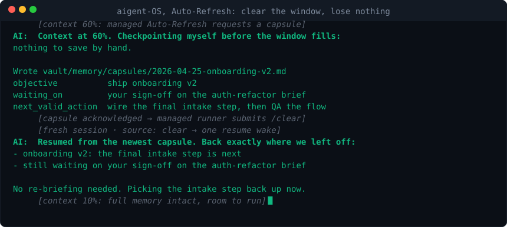
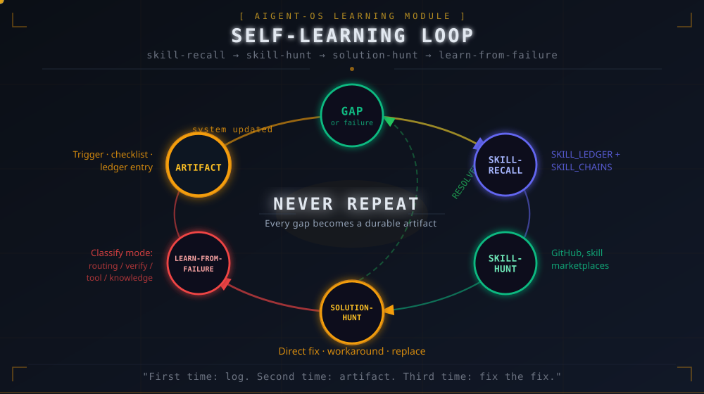

<div align="center">



<br/>

[](LICENSE)
[](https://claude.ai/code)
[](https://obsidian.md)
[](#-quick-start)
[](https://github.com/wrg32786/aigent-os/actions/workflows/ci.yml)
[](SECURITY.md)
[](#-contributing)

**The AI that remembers everything — because it operates itself.**

*One operator, one Claude, one vault. No cold starts, no re-explaining yourself, ever.*

[Quick Start](#-quick-start) · [Architecture](#-architecture) · [Key Concepts](#-key-concepts) · [Customize](#-make-it-yours) · [Docs](docs/getting-started.md)

</div>

---

## What if your AI remembered everything?

Every priority. Every decision. Every thread left open since last week. What if your AI knew exactly what it could decide on its own — and what to bring to you first? What if it delegated the grunt work to faster, cheaper agents, and stayed focused on strategy itself?

That's aigent-OS. **A 16-document kernel (plus extended specs) that turns Claude Code into a persistent operating system** — one operator, one Claude, running on your own machine, remembering everything in between.

No database. No server. No build step. Drop the files in, open a session, and your AI already knows who it is, what it's working on, and what matters today. This repo even ships itself: aigent-OS uses its own skills to decide what it's learned is worth publishing, sanitize it, and open the pull request. That's the category claim. ([How this repo maintains itself](#-how-this-repo-maintains-itself) · [Manifesto](docs/manifesto.md))

> **Dependency model:** The core kernel is markdown + shell — no build step, no database, no server. Optional features (semantic search, hooks automation) require Node.js 18+ and are installed automatically by the installer if Node is present. Obsidian is optional for visual vault navigation.

<details>
<summary>Text version of the demo below (nothing typed, aigent-OS surfaces open threads on its own)</summary>

```
[new Claude Code session — nothing typed]
aigent: 3 open threads from yesterday. Delegation tracker has 2 items pending review.
       Priority 1 is blocked — surfacing now. What do you want to hit?
```

</details>

> **Recent:** the v0.9 two-verb lifecycle (`/context-capsule` + `/resume`, superseding manual `/open`/`/close`), the cognitive architecture, the self-learning engine, and the somatic layer all shipped between v0.5 and v0.9 — see [`CHANGELOG.md`](CHANGELOG.md) for dates and detail.

---

## 🆚 Compared to the field

Every framework claims to be different. Here's exactly where that's true for aigent-OS — and where it isn't, yet.

| | aigent-OS | claude-mem | SuperClaude Framework | Claude-Claw | Native Auto-Memory/Dream |
|---|:---:|:---:|:---:|:---:|:---:|
| Persistent cross-session memory | ✅ | ✅ | ❌ | ✅ | ✅ (first-party) |
| Git-native, auditable memory store | ✅ | ❌ (SQLite+Chroma, outside version control) | n/a | ⚠️ files trackable, not sync-verified | ❌ |
| Compaction-survival auto-resume | ✅ | partial (Stop-hook based) | ❌ | ✅ (`/handoff`) | ✅ (native) |
| 3-tier memory architecture | ✅ | ❌ (flat) | ❌ | ✅ (same shape) | ❌ (2-tier) |
| Self-testing of its own operating rules | ❌ (Roadmap) | ❌ | partial (pre/post code-quality checks, not self-rules) | ❌ | ❌ |
| Model-tier routing across sub-agents, enforced | ✅ | ❌ | ✅ (behavioral config) | ❌ | n/a |
| Non-Claude execution (Codex, others) | ✅ (single task class) | ❌ | ❌ | ❌ | n/a |

**The honest framing:** compaction-survival and cross-session memory are populated categories now — several projects do them well. Git-native auditability is where this repo is currently ahead. Routing and non-Claude execution used to be claims this repo made without the code behind them. Both now have a real, tested mechanism — scoped honestly to what's actually shipped, not what's aspirational.

---

## 📋 Master capability table

| Capability | Mechanism | Ships today? |
|---|---|---|
| Auto-firing two-verb lifecycle | Session end writes a resume-ready capsule; next boot loads the newest one and re-grounds fully after `/clear` — no `/open`/`/close` typing required | ✅ shipped |
| Git-native vault memory | Every closed capsule cycle is a real commit, pushed to your configured remote — auditable with plain `git log`, not an opaque DB | ✅ shipped |
| Somatic layer | Five lazy-computed pressure gauges (context, memory backlog, decision pressure, token usage, drift) read before acting, no daemon polling | ✅ shipped |
| Self-learning engine | Skill recall → skill hunt → solution hunt escalation chain; every failure becomes a durable artifact | ✅ shipped |
| Cognitive architecture | Persistent self-model, goal stack, belief tracking with confidence scores, human-gated `/dream` consolidation, `/reconcile`, `/meta-improve` | ✅ shipped |
| Caddy skill router | Non-blocking prompt-matching hook surfaces the right skill from your own catalog; auto-reindexes on drop-in | ✅ shipped |
| 3-tier memory (napkin → index → deep) | Heat-scored top-20 + staged digest sit above full topic files | ✅ shipped |
| Model-tier dispatch enforcement | A `PreToolUse` hook checks every named agent's `Agent`-tool dispatch against its declared model tier live; advisory by default, `AIGENT_MODEL_GUARD=enforce` opts into a hard block | ✅ shipped — [`docs/model-routing-enforcement.md`](docs/model-routing-enforcement.md) |
| Non-Claude execution (Codex adapter) | One bounded, mechanical task class routed to the Codex CLI's non-interactive `codex exec`, review-gated, never auto-merged | ✅ shipped (single task class) — [`docs/codex-adapter.md`](docs/codex-adapter.md) |
| Nightly self-maintenance (individual) | Sequencing `/dream`, `/reconcile`, `/sweep-now`, `/digest` into one named routine over your own vault | ❌ not shipped — Roadmap |
| Self-testing of one's own operating rules | A portable subset of the probe idea, scoped to one seat's own behavior | ❌ not shipped — Roadmap |

---

## 🎬 See it happen

<div align="center">

</div>

<div align="center">

</div>

Both clips are the real dialogue from [What a session actually looks like](#-what-a-session-actually-looks-like) below, rendered as self-contained animated SVGs — no video, no external assets. Generator: [`assets/build-terminal-demo.mjs`](assets/build-terminal-demo.mjs).

---

## ⚡ Quick Start

### Already have a coding agent open? Skip the terminal:

```text
Clone or download this repo (https://github.com/wrg32786/aigent-os) into the current
directory, then run `bash install.sh` from inside it. If Node.js 18+ is available, let
the installer wire semantic search too; otherwise pass --no-deps. When it finishes,
start a new session in this same directory, read whatever it prints on boot, and tell
me what you'd like to work on first.
```

Your agent reads its own install script, runs it, and reports back what it found — no shell flags to remember yourself. Pasting this into an agent? Use the block above. Typing in your own terminal? Use the block below.

### From your downloaded folder:

```bash
bash install.sh
```

That's it. aigent-OS installs into whatever directory you're in — your existing project, your home folder, wherever you work. The installer copies the kernel files, creates `.claude/settings.json` with your actual paths substituted, and installs semantic search if Node.js is available.

> **Optional `--no-deps`:** skips the Node.js semantic-search install. **Other flags:** `--target <dir>` installs elsewhere, `--dry-run` previews every change. See [Advanced Setup](docs/advanced-setup.md).

**Start a new Claude Code conversation** in the same directory. aigent-OS is live: it resumes itself on start, handles routing/memory/delegation while you work, and checkpoints itself when the session ends, compacts, or clears — no `/open` or `/close` to type. `/context-capsule` and `/resume` remain available on demand.

**Prefer an app to a terminal?** Run `launcher/install.sh` (or `install.ps1` on Windows) once, then double-click the AIgent icon — warm-resumed via `claude --continue`, no `cd` and no cold start. See [`launcher/README.md`](launcher/README.md).

**Optional:** open the `vault/` folder in [Obsidian](https://obsidian.md) to see your AI's knowledge graph visually.

Full setup walkthrough: [Getting Started](docs/getting-started.md) · Advanced config: [Advanced Setup](docs/advanced-setup.md)

### If something doesn't boot

- **No Node.js installed:** the kernel still works — you just lose semantic search and the Node-based hooks. Run `bash install.sh --no-deps`, or install Node 18+ later and run `npm install` inside `daemons/semantic-search/` to wire it retroactively.
- **Windows, and `bash: command not found`:** `install.sh` needs a real bash. Install [Git for Windows](https://git-scm.com) (bundles Git Bash), then reopen your terminal and retry — PowerShell alone can't run it.
- **Anything else:** `bash scripts/doctor.sh` diagnoses hooks, settings, semantic search, and runtime state in one pass. See [Getting Started § Troubleshooting](docs/getting-started.md).

---

## 🗂 Repo Map

```
system/                            The 16-document operating kernel (00_identity → 15_somatic_layer)
vault/                             Persistent memory and knowledge graph (markdown, Obsidian-native)
vault/agents/                      Instrument roster — 9 named sub-agents
skills/                            Claude Code slash-command skills (60+ source templates)
hooks/                             Automation hook scripts (session summary, token tracking, compact nudge)
daemons/                           Background helpers (Caddy, semantic search, memory-heat, runtime state)
docs/                              Setup guides, doctrine references, architecture roadmaps
memory/                            Ledger templates (SKILL_LEDGER, SKILL_GAPS, SKILL_CHAINS, facts/)
memory/runtime/                    Cognitive layer (ACTIVE_STATE, SELF_MODEL, GOAL_STACK, BELIEF_STATE)
evals/                             Evaluation test definitions (skill-recall, contradiction, capsule-resume)
install.sh                         One-line installer
```

> **Skills path note:** `skills/` contains source templates; the installer copies them to `.claude/skills/`, where Claude Code looks for slash commands at runtime. Manually added skills go in `.claude/skills/<name>/SKILL.md`.

---

## 👀 What a session actually looks like

### Day one — the it-remembers-me moment

```text
[first Claude Code session after install]

AI:  I'm your AIgent operator. Let's get you one real win in the next few minutes.
     In a sentence or two, what's your business, or the work you want help running?

You: I run a bookkeeping practice for trades — electricians, plumbers, HVAC.

AI:  Got it. What's the one outcome that would make this month a win?

You: Five new clients, without working weekends.

AI:  And what do you spend the most time on that you wish just ran itself?

You: Chasing leads. I'm always the one following up.

AI:  Here's what I know about you: you run a bookkeeping practice for trades, you
     want five new clients this month without working weekends, and chasing leads
     eats your time.

     Three things I'd do first:
     1. Draft a week of outreach to local trade businesses, so lead-chasing
        runs without you.
     2. Build a "new client" intake that collects everything you need before
        the first call.
     3. Turn last month's finished jobs into three referral asks.

     Pick one and we'll do it right now.
```

That's `/operator-setup` — three plain questions, on first run only, and the answers are written to memory so every session after opens already oriented around *your* business, not a generic template. Nothing here is invented; it only reflects what you actually said.

### Every session after — resumes itself

```text
[new Claude Code session — nothing typed]

AI:  3 open threads from yesterday.
     - Pricing decision pending (you said you'd think on it overnight)
     - Engineering brief for the auth refactor needs your sign-off
     - Onboarding flow draft ready for your review

     Active priorities:
     1. Close the bridge round (blocked on legal review)
     2. Ship onboarding v2 (in progress, ~70% done)
     3. Hire #5 engineer (interviews scheduled this week)

     Last session you were heads-down on the onboarding flow.
     Want to pick that up, or hit one of the open threads first?

You: pricing first. Going with $49 annual, $59 monthly.

AI:  Locked. I'm writing it to vault/concepts/Pricing Strategy.md and
     logging the decision in DECISION_LOG. Reasoning captured: 17%
     monthly premium is standard SaaS, annual-pre-pay customers
     churn 4× less. Want me to also draft the pricing-page copy
     change for engineering, or is that part of onboarding v2?

You: part of v2.

AI:  Got it. Updating the Onboarding v2 project note. Anything else
     before we move on?

[... 90 minutes of work ...]

[you close the terminal — nothing typed]

[capsule fires automatically: reconciles the session, writes to vault/daily/2026-04-25.md]

     What got decided today:
     - Pricing: $49/$59 split. Logged.
     - Onboarding v2: ship Friday, no further scope additions.

     Open threads carrying to next session:
     - Engineering brief still pending sign-off
     - Hire #5 — call back to candidate B by Tuesday

     See you tomorrow.
```

That's the loop — except you never typed either verb. `resume` → work → `capsule`, both automatic, both still callable by hand when you want to force one. The vault remembers everything. Next session picks up exactly where you left off. See [`vault/examples/`](vault/examples/) for what populated content actually looks like.

---

## 🎯 Who this is for

aigent-OS is built for **principals running complex parallel work** — not for developers building agent pipelines.

- **Solo founders** juggling product, hiring, fundraising, and ops simultaneously.
- **Technical leads** managing multiple workstreams across teams.
- **Operators** in any role where the job is to make decisions, route work, and not lose context.

If you've ever closed your laptop on Friday and opened it Monday wondering what the hell you were in the middle of — that's the problem this solves.

If you're building an agent framework for end-users to consume, you probably want LangChain or CrewAI instead. aigent-OS optimizes for **one principal, many threads, persistent context** — and ships a [branded desktop launcher](launcher/README.md) for exactly that: install once, and every session after starts from a double-clicked icon, not a `cd` and a remembered command.

---

## 🔀 Agent Routing and Multi-LLM Execution

### Today

- **Model-tier dispatch enforcement** — `system/09_subagent_manifest.md` names which tier (Fast/Mid/Frontier) each agent should run at; `daemons/model-tier-guard.mjs`, a `PreToolUse` hook, checks every `Agent`-tool dispatch against that declared tier live. Default is advisory (prints a named correction, never blocks — matching this repo's own suggest-don't-block hook doctrine); `AIGENT_MODEL_GUARD=enforce` opts into a hard `decision:block` gate. Scope: Agent-tool dispatches in one session — not the separate-instance or scheduled deployment models in [`docs/creating-agents.md`](docs/creating-agents.md). Design: [`docs/model-routing-enforcement.md`](docs/model-routing-enforcement.md).
- **Codex adapter** — `daemons/codex-adapter.sh` routes one bounded, mechanical task to the [Codex CLI](https://developers.openai.com/codex)'s non-interactive `codex exec` mode: the first working non-Claude executor. Generic config surface (`AIGENT_CODEX_BIN`, no hardcoded paths), never commits or pushes — every run writes a working-tree diff for review under the same gate as any sub-agent's output. Skill: [`skills/codex-adapter/SKILL.md`](skills/codex-adapter/SKILL.md). Design: [`docs/codex-adapter.md`](docs/codex-adapter.md).

### Next

- **Route by task class, not just one class.** The Codex adapter proves the shape for one bounded task type; generalizing to route by task class (and to wire additional CLIs — Gemini CLI, opencode, and others — behind the same interface) is the next step, not something this README implies is already live.
- Every rival harness surveyed for this redo locks you to one vendor's model. This one is built to route across them once that generalization ships — dated here so the claim ages honestly rather than getting stale.

---

## 🏗 Architecture

<div align="center">

</div>

**16 system documents** (`00_identity` → `15_somatic_layer`) are a complete operating manual — how the AI thinks, decides, delegates, remembers, and manages time. Not prompts; a kernel. Full index: [`system/`](system).

**Hooks are the nervous system** — shell/Node scripts on Claude Code's session events (`SessionStart`, `PreToolUse`, `PostToolUse`, `Stop`, `PreCompact`, `SessionEnd`). Auto-capture, session summaries, token tracking, compact nudges, the model-tier guard above, and the [zero-leak flush legs](docs/zero-leak-flush.md) that keep the capsule at most one turn stale across crashes, clears, and compaction all live here.

**Semantic search** runs locally (`all-MiniLM-L6-v2`, no API calls, no data leaves your device) — `node daemons/semantic-search/search-vault.js "what did we decide about pricing"` searches your vault by meaning, not keywords.

---

## 🔑 Key Concepts

<div align="center">


<br/>


</div>

**Vault as brain.** Your AI's memory is an Obsidian vault, not a vector database — the same files you can open, read, search, and navigate yourself. Wikilinks (`[[Project Alpha]]`) build the knowledge graph; the graph IS the intelligence. `resume` reads it, `capsule` writes to it, both fire on their own. When a deliberate close happens, aigent-OS stages only the changed durable memory files, commits (`vault sync:`), and pushes to your configured remote — a silent no-op with no remote configured. See the [two-verb lifecycle doc](docs/two-verb-lifecycle.md) for the full write-ahead/flush contract.

> **Testing isolation:** scripting `claude` child sessions inside your vault directory means their Stop autosaves write *real* capsules into your *real* vault. Point automated children at a scratch root via `AIGENT_ROOT`.

**Caddy — the skill that finds the right skill.** A non-blocking `UserPromptSubmit` hook matches your words against every skill in your catalog and surfaces the one that fits, without ever blocking the turn on a wrong guess. A `PostToolUse` hook detects a newly dropped skill and nudges `/caddy-enroll` to index it — the golf bag stays complete without manual upkeep.

**Measurement layer.** Most agent frameworks let the AI talk; almost none measure how often it's confidently wrong. `HONESTY_LEDGER.md`, `TRUST_DECAY.md`, and `FAILURE_MODES.md` are paired ledgers — a claim captured, then resolved later as held/drifted/reversed — plus drift detection at `resume` (decision aging, attention reconciliation vs. `ACTIVE_PRIORITIES.md`). The credible claim: the framework measures its own AI's calibration over time, not just its output. Full doctrine: [`vault/concepts/Cost of Confidence.md`](vault/concepts/Cost%20of%20Confidence.md).

**Self-aware about what it doesn't do yet.** `system/12_authority_matrix.md` bounds what the AI decides alone vs. brings to you; `/dream` proposes improvements but only the operator approves merges — see [`docs/meta-aigent-doctrine.md`](docs/meta-aigent-doctrine.md) for the safety boundary.

---

## 🎨 Make It Yours

aigent-OS is opinionated but built to be forked.

**Start here (10 minutes):**
1. `system/00_identity.md` — tell it who you are
2. `system/14_decision_framework.md` — encode how YOU make decisions
3. `system/12_authority_matrix.md` — set boundaries that match YOUR risk tolerance

**Then build over time:** add your projects to `vault/projects/`, your people to `vault/people/`, drop concepts into `vault/concepts/`. The vault grows with every session — it compounds.

---

## 🔁 How this repo maintains itself

The most differentiating thing about aigent-OS isn't a feature — it's that the framework operates on itself. When the principal's local aigent-OS learns something worth generalizing, aigent-OS is the one that classifies it (`private: true | false | review` frontmatter, defaulting new files to `review`), tests it against a genericity bar (useful to at least three radically different principals, or it stays private), scans it for secrets, drafts the commit, and opens the PR. The publish skill is itself one of aigent-OS's skills — the recursive layer is the actual category claim. Every managed release appends to [`CHANGELOG.md`](CHANGELOG.md): what shipped, what was held back, and why. Full manifesto: [`docs/manifesto.md`](docs/manifesto.md).

---

## ❌ What This Isn't

**Not a chatbot skin.** No personality prompts, no "you are a helpful assistant" — operational infrastructure.

**Not a code framework.** No `npm install` required, no Python environment, no build step. The kernel is markdown.

**Not a RAG system.** The vault is human-readable by design — open Obsidian, don't query an embedding store.

**Not another agent framework.** LangChain and CrewAI are for developers building pipelines. aigent-OS is for principals who want an AI that actually operates — one operator, one Claude, at a time.

---

## 🛣 Roadmap

Explicitly non-normative — nothing below is claimed as shipped, and none of it appears in the tables above until it is.

- **Nightly self-maintenance** — sequencing `/dream`, `/reconcile`, `/sweep-now`, and `/digest` into one named routine over your own vault, run on a cadence instead of ad hoc.
- **Self-testing of one's own operating rules** — a portable subset of the probe idea, scoped to testing one seat's own shipped mechanisms against its own doctrine.
- **A generic recurring-task primitive** — a portable tick/heartbeat structure for "run this on a cadence," session-hook-driven today, wall-clock-driven as the next step. Structure only, no built-in business-specific firers, and no coupling to any multi-agent coordination substrate.
- **Codex adapter generalization** — routing by task class, and additional non-Claude CLIs behind the same interface (see [Agent Routing and Multi-LLM Execution](#-agent-routing-and-multi-llm-execution) above).
- **`vault-sync.mjs` path-scoping polish** — tightening the memoryPaths exists-filter at the edges of what counts as "durable memory" for a sync commit.

One structural note, since it comes up: everything in this repo is scoped to a single operator running a single Claude session at a time. The vault, the capsule lifecycle, Caddy, and the routing/execution primitives above are the kind of building blocks a multi-operator, multi-agent layer would sit on top of — that layer is not part of this repo.

---

## 🤝 Contributing

PRs welcome. See [CONTRIBUTING.md](CONTRIBUTING.md) for what lands well and how to write rules that fit the existing style. Highest-value areas: decision framework lenses for new domains, hook scripts for additional Claude Code events, vault templates, integration guides, sanitized examples for [`vault/examples/`](vault/examples/).

See [CHANGELOG.md](CHANGELOG.md) for release notes.

---

<div align="center">

### 📄 [MIT License](LICENSE) — Use it however you want.

<br/>

Built by **[Will Gwyn](https://github.com/wrg32786)**

*Battle-tested across multiple ventures. Months of daily use.*
*This framework emerged from real operational needs — not theory.*

<br/>

**If this saves you time, star the repo. That's all the thanks needed.**

</div>
