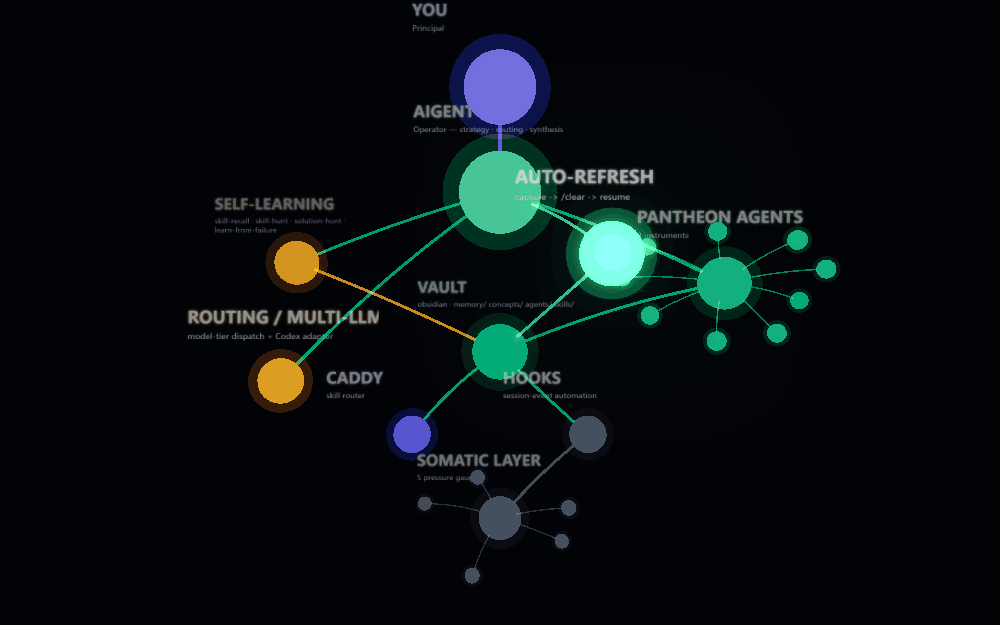

<div align="center">


<br/>

[](https://github.com/wrg32786/aigent-os/stargazers)
[](LICENSE)
[](https://claude.ai/code)
[](https://obsidian.md)
[](https://github.com/wrg32786/aigent-os/actions/workflows/ci.yml)
[](SECURITY.md)
[](#-contributing)

**Stop re-briefing your AI every morning.**

*aigent-OS gives Claude Code durable memory and autonomous context refresh: it watches context pressure, saves a verified capsule, clears and rebinds the session, then continues the work without interrupting the operator. A free, open-source operator layer, not a chat wrapper.*

From the team behind [The AIgent](https://theaigent.xyz), a free media project for people building with AI.

[Quick Start](#-quick-start) · [Auto-Refresh](#-auto-refresh) · [Architecture](#-architecture) · [Key Concepts](#-key-concepts) · [Customize](#-make-it-yours) · [Docs](docs/getting-started.md)

If aigent-OS saves you time, [star the repo](https://github.com/wrg32786/aigent-os) so other people can find it.

</div>

---

## See it resume itself

<div align="center">

</div>

The animation illustrates the lifecycle. In the shipped default, Managed Auto-Refresh performs the whole boundary automatically: at the configured context threshold it requests a capsule, waits for the exact completion acknowledgement, submits one `/clear`, binds the fresh session, and submits one resume wake.

**aigent-OS is a 16-document kernel (plus extended specs) that turns Claude Code into a persistent operating system**, one operator, one Claude, running on your own machine. No database, no server, no build step: drop the files in, run `bash install.sh`, and the next session already knows who it is and what it's working on. The framework also ships tools for maintaining itself: a nightly self-maintenance routine you can run against your own vault, and a hook that spots a new skill file and prompts you to enroll it. The publish half, deciding what a local install has learned that's worth graduating to this repo, sanitizing it, and opening the pull request, is designed and not built. ([How this repo maintains itself](#-how-this-repo-maintains-itself) · [Manifesto](docs/manifesto.md))

> **Dependency model:** the core kernel is markdown + shell: no database or server. The default installer requires Node.js 18+, installs and verifies the managed Auto-Refresh transport, and wires the `aigent` front door automatically. `--no-deps` is the explicit fallback when you deliberately want to skip Node dependencies. Obsidian is optional, for browsing the vault visually.

Unlike memory add-ons that keep state in an opaque database, every checkpoint here is a real git commit, readable with plain `git log`, not a query against someone else's schema. The table below scores the rest against real rivals, not strawmen.

> **Recent:** managed Auto-Refresh now ships in the public core, alongside the two-verb lifecycle, model-tier dispatch enforcement, and the Codex adapter. See [`CHANGELOG.md`](CHANGELOG.md) for dates and detail.

---

## 🆚 Compared to the field

Every framework claims to be different. Here's exactly where that's true for aigent-OS, and where it isn't, yet.

| | aigent-OS | claude-mem | SuperClaude Framework | Claude-Claw | Native Auto-Memory/Dream |
|---|:---:|:---:|:---:|:---:|:---:|
| Persistent cross-session memory | ✅ | ✅ | ⚠️¹ | ✅ | ✅ (first-party) |
| Git-native, auditable memory store | ✅ | ❌ (SQLite+Chroma, outside version control) | n/a | ⚠️ files trackable, not sync-verified | ❌ |
| Compaction-survival auto-resume | ✅ | partial (Stop-hook based) | ❌ | ✅ (`/handoff`) | ✅ (native) |
| 3-tier memory architecture | ✅ | ❌ (flat) | ❌ | ✅ (same shape) | ❌ (2-tier) |
| Self-testing of its own operating rules | ❌ (Roadmap) | ❌ | partial (pre/post code-quality checks, not self-rules) | ❌ | ❌ |
| Model-tier routing across sub-agents, enforced | ✅ advisory default, opt-in enforce | ❌ | ✅ (behavioral config) | ❌ | n/a |
| Non-Claude execution (Codex, others) | ✅ (single task class) | ❌ | ❌ | ❌ | n/a |

¹ via bundled Serena MCP.

**The honest framing:** compaction-survival and cross-session memory are populated categories now; several projects do them well. Git-native auditability is where this repo is currently ahead. Routing and non-Claude execution are real, tested mechanisms, scoped in the table to exactly what ships and no more.

---

## 📋 Master capability table

| Capability | Mechanism | Ships today? |
|---|---|---|
| **Auto-Refresh** (autonomous memory + context) | Managed local runner: pressure threshold → one capsule request → exact acknowledgement → one `/clear` → fresh SessionStart identity → one resume wake. Busy output uses Claude Code's native prompt queue instead of blocking the cycle. | ✅ shipped ([details](#-auto-refresh)) |
| Git-native vault memory | Every closed capsule cycle is a real commit, pushed to your configured remote, auditable with plain `git log`, not an opaque DB | ✅ shipped |
| Somatic layer | Five lazy-computed pressure gauges (context, memory backlog, decision pressure, token usage, drift) read before acting, no daemon polling | ✅ shipped |
| Self-learning engine | Skill recall → skill hunt → solution hunt escalation chain; every failure becomes a durable artifact | ✅ shipped |
| Cognitive architecture | Persistent self-model, goal stack, belief tracking with confidence scores, human-gated `/dream` consolidation, `/reconcile`, `/meta-improve` | ✅ shipped |
| Calibration measurement | `HONESTY_LEDGER`, `TRUST_DECAY`, and `FAILURE_MODES` are paired ledgers: a claim captured, then resolved as held, drifted, or reversed; drift detection runs at `resume`, and a `Stop` hook prompts the capture when a turn's confident claims went unrecorded | ✅ shipped |
| Caddy skill router | Non-blocking prompt-matching hook surfaces the right skill from your own catalog; auto-reindexes on drop-in | ✅ shipped |
| 3-tier memory (napkin → index → deep) | Heat-scored top-20 + staged digest sit above full topic files | ✅ shipped |
| Model-tier dispatch enforcement | A `PreToolUse` hook checks every named agent's `Agent`-tool dispatch against its declared model tier live; advisory by default, `AIGENT_MODEL_GUARD=enforce` opts into a hard block | ✅ shipped ([`docs/model-routing-enforcement.md`](docs/model-routing-enforcement.md)) |
| Non-Claude execution (Codex adapter) | One bounded, mechanical task class routed to the Codex CLI's non-interactive `codex exec`, review-gated, never auto-merged | ✅ shipped (single task class; [`docs/codex-adapter.md`](docs/codex-adapter.md)) |
| Nightly close-parity maintenance | Seven framework legs produce eleven independently validated checkpoints, append-only failure alerts, and a session-start no-fire fallback that needs no external scheduler or transport. Human judgment stays staged for review. | ✅ shipped ([`docs/nightly-self-maintenance.md`](docs/nightly-self-maintenance.md)) |
| Self-testing of one's own operating rules | A portable subset of the probe idea, scoped to one seat's own behavior | ❌ not shipped (Roadmap) |

---

## 🎬 See it happen

<div align="center">

</div>

The first-run onboarding: three plain questions, then a first plan. (The resume/checkpoint side of the loop is the clip at the top of this README.) Both are the real dialogue from [What a session actually looks like](#-what-a-session-actually-looks-like) below, rendered as self-contained animated SVGs, no video, no external assets. Generator: [`assets/build-terminal-demo.mjs`](assets/build-terminal-demo.mjs).

---

## ⚡ Quick Start

### Already have a coding agent open? Skip the terminal:

```text
Clone or download this repo (https://github.com/wrg32786/aigent-os) into the current
directory, then run `bash install.sh` from inside it. The default installer requires
Node.js 18+, installs and verifies the managed Auto-Refresh runner, and wires the
`aigent` front door. When it finishes, open a new terminal and run `aigent`.
```

Your agent reads its own install script, runs it, and reports back what it found: no shell flags to remember yourself. Pasting this into an agent? Use the block above. Typing in your own terminal? Use the block below.

### From your downloaded folder:

```bash
bash install.sh
```

That's it. aigent-OS installs into whatever directory you're in: your existing project, your home folder, wherever you work. The installer copies the kernel files, creates `.claude/settings.json`, installs and verifies managed Auto-Refresh, and wires the `aigent` command plus the platform launcher where supported.

> **Explicit fallback `--no-deps`:** skips Node dependencies, including semantic search and the managed PTY transport; the launcher then uses its loud unmanaged fallback when the transport is unavailable. **Other flags:** `--target <dir>` installs elsewhere, `--dry-run` previews every change, and `--no-launcher` skips PATH/shortcut wiring. See [Advanced Setup](docs/advanced-setup.md).

**Open a new terminal and run `aigent`.** The installer has already wired the managed runner. The first launch runs guided setup; later launches warm-resume, track context pressure, checkpoint, clear, rebind, and continue without an operator command.

**Prefer an app to a terminal?** The same install creates the AIgent app/shortcut where supported. Open it instead of typing `aigent`. See [`launcher/README.md`](launcher/README.md).

**Optional:** open the `vault/` folder in [Obsidian](https://obsidian.md) to see your AI's knowledge graph visually.

Full setup walkthrough: [Getting Started](docs/getting-started.md) · Advanced config: [Advanced Setup](docs/advanced-setup.md)

### If something doesn't boot

- **No Node.js installed:** the default install stops because managed Auto-Refresh is the default. Install Node.js 18+ and rerun `bash install.sh`; use `--no-deps` only when you deliberately want the unmanaged fallback.
- **Windows, and `bash: command not found`:** `install.sh` needs a real bash. Install [Git for Windows](https://git-scm.com) (bundles Git Bash), then reopen your terminal and retry; PowerShell alone can't run it.
- **Anything else:** `bash scripts/doctor.sh` diagnoses hooks, settings, semantic search, and runtime state in one pass. See [Getting Started § Troubleshooting](docs/getting-started.md).

---

## 🗂 Repo Map

```
system/                            The 16-document operating kernel (00_identity → 15_somatic_layer)
vault/                             Persistent memory and knowledge graph (markdown, Obsidian-native)
vault/agents/                      Instrument roster: 9 named sub-agents
skills/                            Claude Code slash-command skills (60+ source templates)
hooks/                             Automation hook scripts (session summary, token tracking, compact nudge)
daemons/                           Background helpers (Auto-Refresh transport, Caddy, semantic search, runtime state)
docs/                              Setup guides, doctrine references, architecture roadmaps
memory/                            Ledger templates (SKILL_LEDGER, SKILL_GAPS, SKILL_CHAINS, facts/)
memory/runtime/                    Cognitive layer (ACTIVE_STATE, SELF_MODEL, GOAL_STACK, BELIEF_STATE)
evals/                             Evaluation test definitions (skill-recall, contradiction, capsule-resume)
install.sh                         One-line installer
```

> **Skills path note:** `skills/` contains source templates; the installer copies them to `.claude/skills/`, where Claude Code looks for slash commands at runtime. Manually added skills go in `.claude/skills/<name>/SKILL.md`.

---

## 🔄 Auto-Refresh: autonomous memory and context management

Auto-Refresh now ships in this repository as a managed local transport. Its user-visible rule is deliberately small:

```text
context pressure rises
→ request one /context-capsule
→ observe exactly one "Capsule Complete, Ready For Clear"
→ submit exactly one /clear
→ observe a fresh source=clear SessionStart identity
→ submit exactly one resume wake
→ load prior work, re-ground, and continue
```

**No acknowledgement means no clear. One acknowledgement buys one clear.** Busy or idle is not a readiness decision: command text and a protected, separately written Enter ride Claude Code's native queued-prompt path and execute when the current turn releases the composer.

### What owns each leg

- `daemons/ctx-telemetry.mjs` records the current context percentage.
- `daemons/auto-clear-transport.mjs` owns the persisted one-cycle authorization and at-most-once clear intent.
- `daemons/pty-runner.mjs` is the sole PTY writer. It queues operator input while automatic command text owns the composer.
- `skills/context-capsule/SKILL.md` writes and verifies the resume-ready capsule, then emits the exact acknowledgement literal.
- `daemons/boot-receipt.mjs` and `daemons/sessionstart-reinject.mjs` provide the fresh SessionStart receipt.
- `daemons/resume-verb.mjs` loads the newest valid capsule as historical work state. The live SessionStart hook ID is the current identity; capsule text and the disk receipt never substitute for it.

The transport writes slash-command text and Enter separately. It also clears stale composer text before `/clear`, protects the wake text/Enter pair, refuses duplicate clear intent, and stops loudly on physical write or identity failures. It does not add an automatic retry after an ambiguous submission.

### Installation and fallback

`bash install.sh` installs the transport's single runtime dependency, `node-pty`, when Node.js 18+ is present. The launchers use the managed runner by default. If the dependency cannot load, Claude still starts, checkpointing and recovery remain available, and the launcher reports that automatic clear is unavailable rather than pretending the managed path is active.

A `--no-deps` install intentionally selects that unmanaged fallback.

### Release evidence

The release candidate completed **11 of 11 observed refresh transport transactions** on one Windows reference seat in one live run: three setup transactions and eight transactions after the test objective began. Every observed transaction produced one capsule request, one acknowledgement, one clear, and one fresh SessionStart identity, with zero stranded acknowledgements and zero duplicate clears.

The accelerated observation harness then failed outside the transport: the model appended several remaining test-witness lines inside one unchanged session and declared the synthetic test complete. That invalidated the harness's proposed 20-cycle bookkeeping claim; it did not produce a failed refresh transaction. The harness used an intentionally low pressure threshold to exercise the mechanism rapidly. Normal users do not run the witness-file protocol.

This is bounded single-seat release evidence, not a fleet-reliability or "20/20" claim. The executable transport files in this public release are the same files used for the successful observed transactions.

See [`docs/two-verb-lifecycle.md`](docs/two-verb-lifecycle.md) for the lifecycle and identity contract.


---

## 👀 What a session actually looks like

### Day one: the it-remembers-me moment

```text
[first Claude Code session after install]

AI:  I'm your AIgent operator. Let's get you one real win in the next few minutes.
     In a sentence or two, what's your business, or the work you want help running?

You: I run a bookkeeping practice for trades: electricians, plumbers, HVAC.

AI:  Got it. What's the one outcome that would make this month a win?

You: Five new clients, without working weekends.

AI:  And what do you spend the most time on that you wish just ran itself?

You: Chasing leads. I'm always the one following up.

AI:  Here's what I know about you: you run a bookkeeping practice for trades, you
     want five new clients this month without working weekends, and chasing leads
     eats your time.

     Three things I'd do first:
     1. Draft a week of outreach to local trade businesses, so lead-chasing
        runs without you.
     2. Build a "new client" intake that collects everything you need before
        the first call.
     3. Turn last month's finished jobs into three referral asks.

     Pick one and we'll do it right now.
```

That's `/operator-setup`: three plain questions, on first run only, and the answers are written to memory so every session after opens already oriented around *your* business, not a generic template. Nothing here is invented; it only reflects what you actually said.

### Every session after: resumes itself

```text
[new Claude Code session, nothing typed]

AI:  3 open threads from yesterday.
     - Outreach batch: 12 of 20 trade businesses contacted, 3 replies waiting on you
     - New-client intake form drafted, needs your sign-off before it goes out
     - Referral asks: 2 of 3 sent, the HVAC client still pending

     Active priorities:
     1. Five new clients this month (2 now in the pipeline)
     2. Lead follow-up runs without you (outreach batch in progress)
     3. Month-end close for existing clients (starts Thursday)

     Last session you were drafting the intake form.
     Want to finish that, or handle the 3 outreach replies first?

You: replies first. Quote them the standard monthly rate.

AI:  Locked. Drafting replies to all 3 with the standard rate, and
     logging the pricing call in DECISION_LOG. Reasoning captured:
     one consistent rate beats per-job haggling for trades, and you
     said no weekends. Want the intake form linked in the replies,
     or is it not ready to send?

You: not yet.

AI:  Got it. Replies go out without it. Anything else
     before we move on?

[... 90 minutes of work ...]

[you close the terminal, nothing typed]

[capsule fires automatically: reconciles the session, writes to vault/daily/2026-04-25.md]

     What got decided today:
     - Standard monthly rate quoted to all new trade leads. Logged.
     - Intake form holds until your sign-off.

     Open threads carrying to next session:
     - HVAC referral ask still pending
     - Intake form sign-off

     See you tomorrow.
```

That's the loop, except you never typed either verb. `resume` → work → `capsule`, both automatic, both still callable by hand when you want to force one. The vault remembers everything. Next session picks up exactly where you left off. See [`vault/examples/`](vault/examples/) for what populated content actually looks like.

---

## 🎯 Who this is for

aigent-OS is built for **principals running complex parallel work**, not for developers building agent pipelines.

- **Solo founders** juggling product, hiring, fundraising, and ops simultaneously.
- **Technical leads** managing multiple workstreams across teams.
- **Operators** in any role where the job is to make decisions, route work, and not lose context.

If you've ever closed your laptop on Friday and opened it Monday wondering what the hell you were in the middle of, that's the problem this solves.

If you're building an agent framework for end-users to consume, you probably want LangChain or CrewAI instead. aigent-OS optimizes for **one principal, many threads, persistent context**, and ships a [branded desktop launcher](launcher/README.md) for exactly that: install once, and every session after starts from a double-clicked icon, not a `cd` and a remembered command.

---

## 🔀 Agent Routing and Multi-LLM Execution

### Today

- **Model-tier dispatch enforcement**: `system/09_subagent_manifest.md` names which tier (Fast/Mid/Frontier) each agent should run at; `daemons/model-tier-guard.mjs`, a `PreToolUse` hook, checks every `Agent`-tool dispatch against that declared tier live. Default is advisory (prints a named correction, never blocks, matching this repo's own suggest-don't-block hook doctrine); `AIGENT_MODEL_GUARD=enforce` opts into a hard `decision:block` gate. Scope: Agent-tool dispatches in one session, not the separate-instance or scheduled deployment models in [`docs/creating-agents.md`](docs/creating-agents.md). Design: [`docs/model-routing-enforcement.md`](docs/model-routing-enforcement.md).
- **Codex adapter**: `daemons/codex-adapter.sh` routes one bounded, mechanical task to the [Codex CLI](https://developers.openai.com/codex)'s non-interactive `codex exec` mode: the first working non-Claude executor. Generic config surface (`AIGENT_CODEX_BIN`, no hardcoded paths), never commits or pushes; every run writes a working-tree diff for review under the same gate as any sub-agent's output. Skill: [`skills/codex-adapter/SKILL.md`](skills/codex-adapter/SKILL.md). Design: [`docs/codex-adapter.md`](docs/codex-adapter.md).

### Next

- **Route by task class, not just one class.** The Codex adapter proves the shape for one bounded task type; generalizing to route by task class (and to wire additional CLIs, such as Gemini CLI, opencode, and others, behind the same interface) is the next step.
- Every rival harness surveyed locks you to one vendor's model. This one is built to route across them once that generalization ships.

---

## 🏗 Architecture

<div align="center">

</div>

**16 system documents** (`00_identity` → `15_somatic_layer`) are a complete operating manual: how the AI thinks, decides, delegates, remembers, and manages time. Not prompts; a kernel. Full index: [`system/`](system).

**Hooks are the nervous system**: shell/Node scripts on Claude Code's session events (`SessionStart`, `PreToolUse`, `PostToolUse`, `Stop`, `PreCompact`, `SessionEnd`). Auto-capture, session summaries, token tracking, compact nudges, the model-tier guard above, and the [zero-leak flush legs](docs/zero-leak-flush.md) that keep the capsule at most one turn stale across crashes, clears, and compaction all live here.

**Semantic search** runs locally (`all-MiniLM-L6-v2`, no API calls, no data leaves your device): `node daemons/semantic-search/search-vault.js "what did we decide about pricing"` searches your vault by meaning, not keywords.

---

## 🔑 Key Concepts

<div align="center">


<br/>


</div>

**Vault as brain.** Your AI's memory is an Obsidian vault, not a vector database, the same files you can open, read, search, and navigate yourself. Wikilinks (`[[Project Alpha]]`) build the knowledge graph your AI actually navigates. `resume` reads it, `capsule` writes to it, both fire on their own: see [Auto-Refresh](#-auto-refresh) above for exactly what gets committed and when. See the [two-verb lifecycle doc](docs/two-verb-lifecycle.md) for the full write-ahead/flush contract.

> **Testing isolation:** scripting `claude` child sessions inside your vault directory means their Stop autosaves write *real* capsules into your *real* vault. Point automated children at a scratch root via `AIGENT_ROOT`.

**Measurement layer.** Most agent frameworks let the AI talk; almost none measure how often it's confidently wrong. `HONESTY_LEDGER.md`, `TRUST_DECAY.md`, and `FAILURE_MODES.md` are paired ledgers (a claim captured, then resolved later as held/drifted/reversed) plus drift detection at `resume` (decision aging, attention reconciliation vs. `ACTIVE_PRIORITIES.md`). The credible claim: the framework measures its own AI's calibration over time, not just its output. A `Stop` hook closes the loop by noticing when a turn made confident claims that no ledger recorded, so the ledgers fill from real work instead of waiting to be remembered: [Closing the Measurement Loop](docs/closing-the-measurement-loop.md). Full doctrine: [`vault/concepts/Cost of Confidence.md`](vault/concepts/Cost%20of%20Confidence.md).

**Caddy: the skill that finds the right skill.** A non-blocking `UserPromptSubmit` hook matches your words against every skill in your catalog and surfaces the one that fits, without ever blocking the turn on a wrong guess. A `PostToolUse` hook detects a newly dropped skill and nudges `/caddy-enroll` to index it; the golf bag stays complete without manual upkeep.

**Self-aware about what it doesn't do yet.** `system/12_authority_matrix.md` bounds what the AI decides alone vs. brings to you; `/dream` proposes improvements but only the operator approves merges: see [`docs/meta-aigent-doctrine.md`](docs/meta-aigent-doctrine.md) for the safety boundary.

---

## 🎨 Make It Yours

aigent-OS is opinionated but built to be forked.

**Start here (10 minutes):**
1. `system/00_identity.md`: tell it who you are
2. `system/14_decision_framework.md`: encode how YOU make decisions
3. `system/12_authority_matrix.md`: set boundaries that match YOUR risk tolerance

**Then build over time:** add your projects to `vault/projects/`, your people to `vault/people/`, drop concepts into `vault/concepts/`. The vault grows with every session; it compounds.

---

## 🔁 How this repo maintains itself

The most differentiating thing about aigent-OS isn't a feature; it's that the framework operates on itself. What ships today is the maintenance half: a nightly self-maintenance routine you can run against your own vault, and a hook that spots a new skill file and prompts you to enroll it. aigent-OS installs no scheduler, so the nightly routine runs when you or your own cron entry runs it. Releases are recorded by hand in [`CHANGELOG.md`](CHANGELOG.md).

The publish half is designed but not built. The intended shape is a skill that classifies each vault file (`private: true | false | review` frontmatter, defaulting new files to `review`), tests it against a genericity bar (useful to at least three radically different principals, or it stays private), secret-scans it, drafts the commit, and opens the PR. **None of that exists yet:** no file carries the flag, no code reads it, and deciding what graduates from a local install into this repo is a manual judgement call today. No plan in this repo schedules the skill itself; the nearest related item is a proposed public-content lint that would keep files marked `private: true` out of release artifacts ([`docs/review-hardening-plan.md`](docs/review-hardening-plan.md)). Full manifesto, including why the recursive layer is the category claim: [`docs/manifesto.md`](docs/manifesto.md).

---

## ❌ What This Isn't

**Not a chatbot skin.** No personality prompts, no "you are a helpful assistant": operational infrastructure.

**Not a code framework.** No `npm install` required, no Python environment, no build step. The kernel is markdown.

**Not a RAG system.** The vault is human-readable by design: open Obsidian, don't query an embedding store.

**Not another agent framework.** LangChain and CrewAI are for developers building pipelines. aigent-OS is for principals who want an AI that actually operates, one operator, one Claude, at a time.

---

## 🛣 Roadmap

Explicitly non-normative: nothing below is claimed as shipped, and none of it appears in the tables above until it is.

- **Self-testing of one's own operating rules**: a portable subset of the probe idea, scoped to testing one seat's own shipped mechanisms against its own doctrine.
- **A generic recurring-task primitive**: a portable tick/heartbeat structure for "run this on a cadence," session-hook-driven today, wall-clock-driven as the next step. Structure only, no built-in business-specific firers, and no coupling to any multi-agent coordination substrate.
- **Codex adapter generalization**: routing by task class, and additional non-Claude CLIs behind the same interface (see [Agent Routing and Multi-LLM Execution](#-agent-routing-and-multi-llm-execution) above).
- **`vault-sync.mjs` path-scoping polish**: tightening the memoryPaths exists-filter at the edges of what counts as "durable memory" for a sync commit.

One structural note, since it comes up: everything in this repo is scoped to a single operator running a single Claude session at a time. The vault, the capsule lifecycle, Caddy, and the routing/execution primitives above are the kind of building blocks a multi-operator, multi-agent layer would sit on top of; that layer is not part of this repo.

---

## 🤝 Contributing

PRs welcome. See [CONTRIBUTING.md](CONTRIBUTING.md) for what lands well and how to write rules that fit the existing style. Highest-value areas: decision framework lenses for new domains, hook scripts for additional Claude Code events, vault templates, integration guides, sanitized examples for [`vault/examples/`](vault/examples/).

See [CHANGELOG.md](CHANGELOG.md) for release notes.

---

## 🌐 The AIgent

aigent-OS is the free, open-source harness of [The AIgent](https://theaigent.xyz), a media project for people building with AI. The rest of what's free to take lives at the [public tools](https://tools.theaigent.xyz).

---

<div align="center">

### 📄 [MIT License](LICENSE): Use it however you want.

<br/>

Built by **[The AIgent](https://theaigent.xyz)**

*In daily production use since April 2026, running a real media business.*
*This framework emerged from real operational needs, not theory.*

<br/>

**If this saves you time, star the repo. That's all the thanks needed.**

</div>
